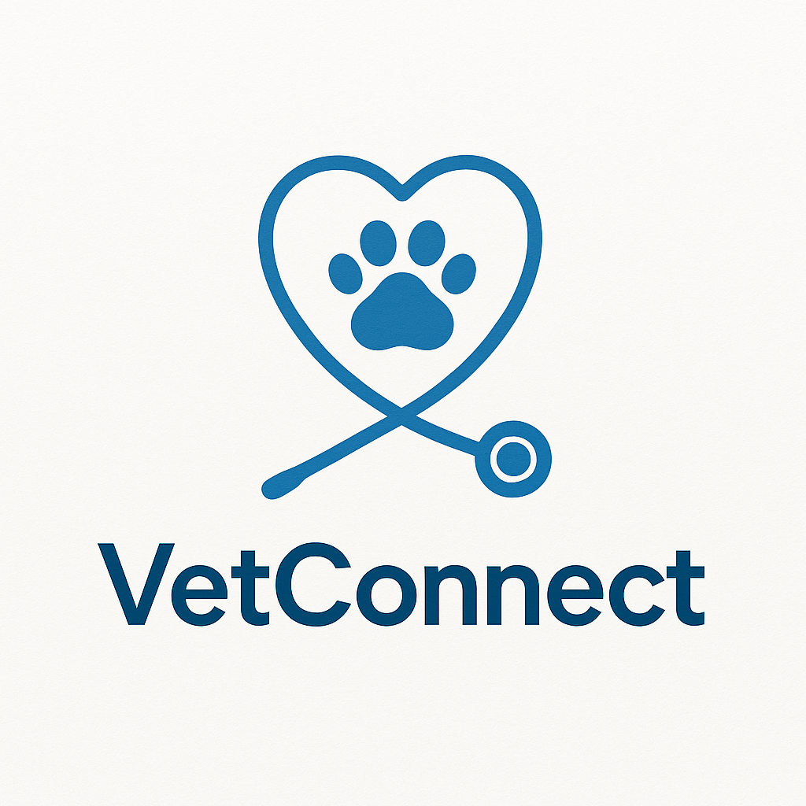

<p align="center">
  
</p>

# 🐾 VetConnect

**VetConnect** is a lightweight, full-stack PHP veterinary clinic management system. It enables clinics to manage pet appointments, record medical reports, and streamline veterinary workflows with clarity and ease.

---

## 🚀 Features

- 🏥 **Vet Dashboard**: View assigned pets, appointments, and medical records.
- 🐶 **Pet Management**: Register and retrieve pet and owner details.
- 📅 **Appointment Scheduling**: Book, assign, and monitor veterinary sessions.
- 🩺 **Medical Reports**: Record diagnostics, treatment plans, and notes.
- 👥 **User Roles**: Support for vets, clients, receptionists, and admins.
- 🔐 **Authentication System**: Login, registration, and session handling.
- 🎨 **Responsive UI**: Tailwind-powered clean and adaptive layout.

---

## 🛠️ Tech Stack

| Layer            | Technology                     |
|------------------|--------------------------------|
| Frontend         | HTML5, Tailwind CSS            |
| Backend          | Classic PHP (No frameworks)    |
| Database         | MariaDB / MySQL                |
| Autoloading      | Manual (PSR-4 Ready Structure) |
| Build Tools      | Tailwind CLI, npm              |
| Dependency Mgmt  | Composer                       |
| Session Handling | Native PHP Sessions            |
| Web Server       | Apache (XAMPP/LAMPP)           |

---

## 📁 Project Structure

```

vetconnect/
├── config/
│   └── config.php
├── public/
│   └── index.php
│   └── assets/
│       ├── css/
│       │   └── main.css
│       ├── js/
│       └── images/
├── src/
│   ├── controllers/
│   ├── models/
│   ├── views/
│   │   └── screens/
│   │       ├── admin/
│   │       ├── client/
│   │       ├── receptionist/
│   │       └── vet/
│   ├── helpers/
│   └── shared/
├── assets/
│   └── css/
│       └── tailwind.css
├── bin/
│   └── tailwind
├── composer.json
├── package.json
└── README.md

````

---

## 🧩 How to Run the Project

### ✅ Prerequisites

- PHP 8.0+
- Composer
- Node.js + npm
- Apache & MySQL (via XAMPP or LAMPP)

---

## 🧬 Database Schema: `vetconnect`

### 📄 Tables Overview

| Table             | Purpose                                                            |
| ----------------- | ------------------------------------------------------------------ |
| `users`           | Stores all system users (clients, vets, admins, receptionists).    |
| `vets`            | Links users to vet profiles and specializations.                   |
| `pets`            | Contains registered pet profiles owned by users.                   |
| `appointments`    | Stores appointments between pets, their owners, and assigned vets. |
| `medical_records` | Records diagnosis, treatment, and visit history for pets.          |
| `prescriptions`   | Links medical records to specific medicines and instructions.      |
| `invoices`        | Keeps track of payments linked to users (billing).                 |

---

## 🧱 SQL to Create Empty Tables

```sql
CREATE TABLE `users` (
  `id` INT(11) NOT NULL AUTO_INCREMENT,
  `name` VARCHAR(100) NOT NULL,
  `username` VARCHAR(50) DEFAULT NULL,
  `email` VARCHAR(100) DEFAULT NULL,
  `phone` VARCHAR(20) DEFAULT NULL,
  `address` TEXT DEFAULT NULL,
  `password` VARCHAR(255) NOT NULL,
  `role` ENUM('admin','vet','receptionist','client') NOT NULL,
  `created_at` TIMESTAMP NULL DEFAULT CURRENT_TIMESTAMP,
  PRIMARY KEY (`id`),
  UNIQUE KEY `username` (`username`)
) ENGINE=InnoDB DEFAULT CHARSET=utf8mb4;

CREATE TABLE `vets` (
  `id` INT(11) NOT NULL AUTO_INCREMENT,
  `user_id` INT(11) NOT NULL,
  `specialiization` VARCHAR(255) DEFAULT NULL,
  `isActive` TINYINT(4) NOT NULL DEFAULT 1,
  `created_at` DATETIME NOT NULL DEFAULT '0000-00-00 00:00:00' ON UPDATE CURRENT_TIMESTAMP,
  `updated_at` DATETIME DEFAULT NULL,
  PRIMARY KEY (`id`),
  KEY `user_id` (`user_id`),
  CONSTRAINT `vets_ibfk_1` FOREIGN KEY (`user_id`) REFERENCES `users` (`id`) ON DELETE CASCADE
) ENGINE=InnoDB DEFAULT CHARSET=utf8mb4;

CREATE TABLE `pets` (
  `id` INT(11) NOT NULL AUTO_INCREMENT,
  `user_id` INT(11) NOT NULL,
  `name` VARCHAR(100) DEFAULT NULL,
  `species` VARCHAR(50) DEFAULT NULL,
  `breed` VARCHAR(50) DEFAULT NULL,
  `age` INT(11) DEFAULT NULL,
  `sex` ENUM('male','female','unknown') DEFAULT NULL,
  `medical_notes` TEXT DEFAULT NULL,
  PRIMARY KEY (`id`),
  KEY `user_id` (`user_id`),
  CONSTRAINT `pets_ibfk_1` FOREIGN KEY (`user_id`) REFERENCES `users` (`id`)
) ENGINE=InnoDB DEFAULT CHARSET=utf8mb4;

CREATE TABLE `appointments` (
  `id` INT(11) NOT NULL AUTO_INCREMENT,
  `name` VARCHAR(255) NOT NULL,
  `owner_id` INT(11) DEFAULT NULL,
  `pet_id` INT(11) NOT NULL,
  `vet_id` INT(11) DEFAULT NULL,
  `appointment_time` DATETIME DEFAULT NULL,
  `reason` TEXT DEFAULT NULL,
  `status` ENUM('scheduled','completed','cancelled','waiting') DEFAULT 'waiting',
  `created_at` TIMESTAMP NULL DEFAULT CURRENT_TIMESTAMP,
  PRIMARY KEY (`id`),
  KEY `pet_id` (`pet_id`),
  KEY `vet_id` (`vet_id`),
  KEY `owner_id` (`owner_id`),
  CONSTRAINT `appointments_ibfk_1` FOREIGN KEY (`pet_id`) REFERENCES `pets` (`id`),
  CONSTRAINT `appointments_ibfk_5` FOREIGN KEY (`vet_id`) REFERENCES `vets` (`id`) ON DELETE CASCADE,
  CONSTRAINT `appointments_ibfk_6` FOREIGN KEY (`owner_id`) REFERENCES `users` (`id`) ON DELETE CASCADE
) ENGINE=InnoDB DEFAULT CHARSET=utf8mb4;

CREATE TABLE `medical_records` (
  `id` INT(11) NOT NULL AUTO_INCREMENT,
  `pet_id` INT(11) NOT NULL,
  `vet_id` INT(11) NOT NULL,
  `visit_date` DATE DEFAULT NULL,
  `diagnosis` TEXT DEFAULT NULL,
  `treatment` TEXT DEFAULT NULL,
  `notes` TEXT DEFAULT NULL,
  `created_at` TIMESTAMP NULL DEFAULT CURRENT_TIMESTAMP,
  PRIMARY KEY (`id`),
  KEY `pet_id` (`pet_id`),
  KEY `vet_id` (`vet_id`),
  CONSTRAINT `medical_records_ibfk_1` FOREIGN KEY (`pet_id`) REFERENCES `pets` (`id`),
  CONSTRAINT `medical_records_ibfk_2` FOREIGN KEY (`vet_id`) REFERENCES `users` (`id`)
) ENGINE=InnoDB DEFAULT CHARSET=utf8mb4;

CREATE TABLE `prescriptions` (
  `id` INT(11) NOT NULL AUTO_INCREMENT,
  `medical_record_id` INT(11) NOT NULL,
  `medicine_name` VARCHAR(100) DEFAULT NULL,
  `dosage` VARCHAR(100) DEFAULT NULL,
  `instructions` TEXT DEFAULT NULL,
  PRIMARY KEY (`id`),
  KEY `medical_record_id` (`medical_record_id`),
  CONSTRAINT `prescriptions_ibfk_1` FOREIGN KEY (`medical_record_id`) REFERENCES `medical_records` (`id`)
) ENGINE=InnoDB DEFAULT CHARSET=utf8mb4;

CREATE TABLE `invoices` (
  `id` INT(11) NOT NULL AUTO_INCREMENT,
  `user_id` INT(11) NOT NULL,
  `amount` DECIMAL(10,2) DEFAULT NULL,
  `status` ENUM('paid','unpaid') DEFAULT 'unpaid',
  `created_at` TIMESTAMP NULL DEFAULT CURRENT_TIMESTAMP,
  PRIMARY KEY (`id`),
  KEY `user_id` (`user_id`),
  CONSTRAINT `invoices_ibfk_1` FOREIGN KEY (`user_id`) REFERENCES `users` (`id`)
) ENGINE=InnoDB DEFAULT CHARSET=utf8mb4;
```

....
### ⚙️ Setup Instructions

1. **Clone this repository** inside your XAMPP/LAMPP `htdocs` folder:
   ```bash
   git clone https://github.com/yourusername/vetconnect.git 
2. **Import the Database**
   Use PHPMyAdmin or CLI to import the provided SQL schema (if included) into MySQL.

3. **Install PHP Dependencies via Composer**

   ```bash
   cd vetconnect
   composer install
   ```

4. **Install Tailwind & JS Dependencies**

   ```bash
   npm install
   ```

5. **Build Tailwind CSS**

   ```bash
   npm run dev
   ```

6. **Create `.env` and copy the variables form  `.env.example` paste into `.env` and replace with your actual values

7. **Launch Apache & MySQL** via XAMPP or `sudo lampp start`
   Then visit:
   👉 [http://localhost/vetconnect/public](http://localhost/vetconnect/public)

---

## 📌 Notes

* All dependencies are managed via Composer (`composer.json`) and npm (`package.json`).
* The Tailwind CSS build is set up using a CLI workflow.
* System can be modularized further with RESTful APIs and token-based auth if required.
* Role-based routing is modularized in the `views/screens` directory.

---

## 👥 Author

**Charles Kahuho**
Built for practical veterinary workflow automation with extendable architecture.

---

## 📄 License

This project is currently **proprietary** and not licensed for distribution or commercial use. For collaboration or customization, contact the author.
